# Arquitetura do Sistema IoMT com MQTT, Tor e Aprendizado Federado para Detecção de Estresse

## 1. Visão geral

Este projeto propõe uma arquitetura para detecção de estresse mental baseada em dispositivos IoMT, comunicação MQTT, anonimização de rede com Tor e aprendizado federado com Flower. O objetivo principal é permitir que sensores vestíveis e dispositivos ESP32 coletem sinais fisiológicos, enviem esses dados para um nó de treinamento local e contribuam para a evolução de um modelo global sem que os dados brutos sejam enviados diretamente para o servidor federado.

A arquitetura foi pensada para preservar a privacidade dos usuários em diferentes níveis:

* Na camada de coleta, os dispositivos IoMT utilizam pseudônimos em vez de identificadores pessoais.
* Na camada de comunicação, o MQTT é utilizado para transmissão leve dos dados dos sensores.
* Na camada de segurança de transporte, TLS e criptografia de payload podem ser usados para proteger os dados transmitidos.
* Na camada de anonimato de rede, o Tor pode ser utilizado entre o gateway e o destino remoto para mascarar o IP de origem e dificultar a correlação entre origem e destino.
* Na camada de aprendizado federado, os dados brutos permanecem no cliente local, enquanto apenas atualizações do modelo são enviadas para o servidor global.

## 2. Objetivo da arquitetura

O objetivo da arquitetura é construir um fluxo seguro e escalável para coleta, processamento e treinamento de modelos de detecção de estresse a partir de sinais fisiológicos.

Os sinais considerados neste projeto são:

* ECG, eletrocardiograma
* EMG, eletromiograma
* EDA, atividade eletrodérmica

Esses sinais são coletados por sensores vestíveis conectados a dispositivos ESP32 ou módulos equivalentes. Em seguida, os dados são encaminhados por MQTT para um gateway local. Esse gateway pode encaminhar os dados por Tor até o nó de treinamento local ou até outro componente remoto da arquitetura.

No nó de treinamento local, os dados são armazenados, pré-processados e utilizados para treinar um modelo local. Posteriormente, o cliente Flower envia apenas os pesos, gradientes ou parâmetros atualizados ao servidor global de aprendizado federado. O servidor global realiza a agregação das atualizações recebidas de múltiplos clientes e redistribui o modelo global atualizado.

## 3. Diagrama geral da arquitetura

```mermaid
flowchart LR
    subgraph C1["Camada 1: Dispositivos IoMT"]
        ESPA["ESP32 / Wearable A<br/>ECG, EMG, EDA"]
        ESPB["ESP32 / Wearable B<br/>ECG, EMG, EDA"]
        ESPC["ESP32 / Wearable C<br/>ECG, EMG, EDA"]
    end

    subgraph C2["Camada 2: Comunicação MQTT e Gateway"]
        MQTT["Broker MQTT Local<br/>Tópico: esp32/data"]
        GW["Gateway MQTT<br/>Recebe dados dos ESPs"]
        TORCLIENT["Cliente Tor / Proxy SOCKS5<br/>Mascaramento de IP"]
    end

    subgraph C3["Camada 3: Rede Tor"]
        TORNET["Rede Tor<br/>Onion Routing<br/>Anonimato topológico"]
    end

    subgraph C4["Camada 4: Nó de Treinamento Local"]
        RX["Recepção MQTT"]
        STORE["Armazenamento local dos dados"]
        PRE["Pré-processamento"]
        FEAT["Extração de características"]
        TRAIN["Treinamento local"]
        LOCALMODEL["Modelo local"]
    end

    subgraph C5["Camada 5: Aprendizado Federado"]
        FLOWERCLIENT["Cliente Flower<br/>FL Client"]
        FLOWERSERVER["Servidor Global Flower gRPC"]
        FEDAVG["Agregação FedAvg"]
        GLOBALMODEL["Modelo global atualizado"]
    end

    subgraph C6["Camada 6: Saída do Sistema"]
        INFER["Inferência local<br/>Detecção de estresse"]
        REDIST["Redistribuição do modelo<br/>para clientes federados"]
    end

    ESPA --> MQTT
    ESPB --> MQTT
    ESPC --> MQTT

    MQTT --> GW
    GW --> TORCLIENT
    TORCLIENT --> TORNET
    TORNET --> RX

    RX --> STORE
    STORE --> PRE
    PRE --> FEAT
    FEAT --> TRAIN
    TRAIN --> LOCALMODEL

    LOCALMODEL --> FLOWERCLIENT
    FLOWERCLIENT -->|"Pesos, gradientes ou parâmetros"| FLOWERSERVER
    FLOWERSERVER --> FEDAVG
    FEDAVG --> GLOBALMODEL
    GLOBALMODEL -->|"Modelo atualizado"| FLOWERCLIENT
    FLOWERCLIENT --> LOCALMODEL

    LOCALMODEL --> INFER
    GLOBALMODEL --> REDIST
    REDIST --> FLOWERCLIENT
```



## 4. Fluxo completo do sistema

### 4.1 Coleta dos sinais fisiológicos

A primeira camada da arquitetura é composta por dispositivos IoMT. Esses dispositivos podem ser ESP32, sensores vestíveis ou módulos embarcados conectados a sensores fisiológicos.

Cada dispositivo realiza a coleta periódica dos sinais fisiológicos relacionados ao estresse, como ECG, EMG e EDA. Esses sinais podem ser coletados em janelas temporais e enviados ao gateway local em formato estruturado, como JSON.

Exemplo de payload MQTT:

```json
{
  "device_id": "esp32_pseudo_001",
  "timestamp": "2026-06-01T14:30:00",
  "ecg": [0.12, 0.14, 0.11, 0.10],
  "emg": [0.52, 0.47, 0.49, 0.51],
  "eda": [1.82, 1.85, 1.83, 1.86]
}
```

O campo `device_id` deve representar um pseudônimo do dispositivo, e não uma identificação pessoal direta do usuário.

### 4.2 Publicação dos dados via MQTT

Após a coleta, os dispositivos publicam os dados em um broker MQTT local. O MQTT é utilizado por ser um protocolo leve, adequado para dispositivos com recursos limitados, como ESP32.

Exemplo de tópico utilizado:

```text
esp32/data
```

O broker MQTT pode estar no próprio gateway local ou em um dispositivo intermediário, como um Raspberry Pi, mini PC, roteador embarcado ou notebook.

O fluxo dessa etapa é:

```text
ESP32 / Wearable -> MQTT -> Broker MQTT Local
```

Recomenda-se que essa comunicação utilize:

* Autenticação de cliente
* MQTT sobre TLS
* Criptografia do payload
* Tópicos padronizados
* Identificadores pseudônimos

### 4.3 Gateway MQTT local

O gateway MQTT é responsável por assinar os tópicos onde os ESP32 publicam seus dados. Ele atua como ponte entre a rede local IoMT e a camada de anonimização com Tor.

Funções principais do gateway:

* Receber mensagens MQTT dos dispositivos IoMT
* Validar o formato do payload
* Remover ou substituir identificadores sensíveis
* Encaminhar os dados para outro broker, serviço ou nó de treinamento
* Encapsular o tráfego de saída por meio do Tor

No protótipo desenvolvido em ambiente local, o notebook pode emular o gateway MQTT. Nesse caso, o Mosquitto roda localmente e um script Python realiza a ponte entre o broker MQTT local e o proxy SOCKS5 do Tor Browser.

Fluxo no protótipo:

```text
mosquitto_pub ou ESP32 -> Mosquitto local -> Gateway Python -> Tor Browser SOCKS5
```

### 4.4 Uso do Tor para anonimato de rede

A rede Tor é usada para mascarar o caminho de rede entre o gateway e o destino remoto. O Tor não substitui criptografia de aplicação, mas contribui para ocultar o IP de origem do gateway perante o serviço de destino.

Na implementação com Tor Browser no Windows, o proxy SOCKS5 normalmente fica disponível em:

```text
127.0.0.1:9150
```

No protótipo, o gateway Python usa esse proxy para enviar a conexão MQTT remota pela rede Tor.

Fluxo conceitual:

```text
Gateway MQTT -> Proxy SOCKS5 local -> Rede Tor -> Serviço remoto
```

Em uma implementação final, o ideal é que cada local físico onde existam sensores possua um gateway próximo aos ESP32. Assim, o tráfego dos dispositivos entra no gateway local e, a partir dele, sai pela rede Tor.

Exemplo de arquitetura final distribuída:

```text
ESP32 remoto -> MQTT/TLS -> Gateway local remoto -> Tor -> Nó de treinamento local ou serviço onion
```

Essa abordagem evita exigir que cada ESP32 rode um cliente Tor completo, o que seria pesado para o hardware do dispositivo.

### 4.5 Recepção dos dados no nó de treinamento local

O nó de treinamento local é o ambiente onde os dados fisiológicos são armazenados, tratados e usados para treinar o modelo local. Esse nó pode ser um notebook, computador local, servidor de borda ou dispositivo com capacidade computacional suficiente.

Funções do nó de treinamento local:

* Receber dados provenientes do MQTT
* Armazenar os dados localmente
* Aplicar limpeza e normalização dos sinais
* Segmentar os dados em janelas temporais
* Extrair características dos sinais fisiológicos
* Treinar o modelo local de detecção de estresse
* Realizar inferência local
* Enviar atualizações do modelo ao servidor federado

Os dados brutos não devem ser enviados ao servidor global. Eles permanecem no ambiente local do cliente.

### 4.6 Pré-processamento dos sinais

Antes do treinamento, os sinais coletados precisam passar por etapas de tratamento. Isso é necessário porque sinais fisiológicos podem conter ruído, perda de amostras, artefatos de movimento e variações entre usuários.

Possíveis etapas de pré-processamento:

* Remoção de ruído
* Normalização
* Filtragem
* Tratamento de valores ausentes
* Segmentação em janelas
* Sincronização temporal entre sensores
* Padronização de frequência de amostragem
* Extração de características estatísticas e temporais

Exemplos de características possíveis:

* Média
* Desvio padrão
* Variância
* Frequência cardíaca estimada a partir do ECG
* Variação da atividade muscular a partir do EMG
* Nível médio de condutância da pele a partir do EDA
* Picos, tendências e variações por janela temporal

### 4.7 Treinamento local do modelo

Após o pré-processamento, o modelo local é treinado com os dados disponíveis no próprio nó de treinamento. Essa etapa é central para a proposta de aprendizado federado, pois evita o envio de dados fisiológicos brutos para o servidor global.

O modelo local pode ser uma rede neural leve, um modelo baseado em LSTM, CNN 1D, MLP ou outro algoritmo adequado para séries temporais fisiológicas.

Fluxo local:

```text
Dados locais -> Pré-processamento -> Extração de características -> Treinamento local -> Modelo local
```

O modelo local aprende padrões específicos do usuário, do dispositivo ou do ambiente de coleta.

### 4.8 Cliente Flower

O cliente Flower é responsável por conectar o nó de treinamento local ao servidor global de aprendizado federado. Ele executa o treinamento local e envia ao servidor apenas os parâmetros atualizados do modelo.

Funções do cliente Flower:

* Receber o modelo global inicial
* Executar treinamento local
* Enviar atualizações do modelo ao servidor global
* Receber o modelo global atualizado
* Repetir o ciclo em novas rodadas federadas

Fluxo do cliente Flower:

```text
Modelo global recebido -> Treinamento local -> Atualização local -> Envio ao servidor global
```

### 4.9 Servidor global Flower gRPC

O servidor global Flower coordena o processo federado. Ele não recebe dados brutos dos usuários. Em vez disso, recebe apenas atualizações dos modelos locais.

Funções do servidor global:

* Coordenar clientes federados
* Enviar o modelo global inicial
* Receber atualizações dos clientes
* Agregar os parâmetros recebidos
* Gerar um novo modelo global
* Redistribuir o modelo atualizado

A comunicação entre clientes Flower e servidor global é realizada via gRPC. Em uma implementação segura, essa comunicação deve usar TLS.

### 4.10 Agregação federada

A agregação federada combina as atualizações dos modelos locais em um modelo global. Uma estratégia comum é o FedAvg, que calcula uma média ponderada dos parâmetros enviados pelos clientes.

Fluxo de agregação:

```text
Atualizações locais de múltiplos clientes -> FedAvg -> Modelo global atualizado
```

A vantagem dessa abordagem é que o servidor global aprende com múltiplos clientes sem acessar diretamente os dados brutos de ECG, EMG e EDA.

### 4.11 Redistribuição do modelo global

Após a agregação, o servidor envia o modelo global atualizado aos clientes federados. Cada cliente pode usar esse modelo para:

* Melhorar sua inferência local
* Iniciar uma nova rodada de treinamento
* Atualizar seu modelo local
* Contribuir novamente com futuras atualizações

Esse processo forma um ciclo contínuo:

```text
Treinamento local -> Envio de atualizações -> Agregação global -> Retorno do modelo -> Novo treinamento local
```

### 4.12 Inferência local

A inferência de estresse deve ocorrer preferencialmente no nó local. Isso permite que o sistema classifique o estado do usuário sem enviar dados fisiológicos sensíveis ao servidor.

Possíveis saídas do modelo:

* Sem estresse
* Estresse baixo
* Estresse moderado
* Estresse alto

Ou, dependendo da abordagem escolhida:

* Classe binária: estresse ou não estresse
* Classe multiclasse: níveis de estresse
* Saída probabilística: probabilidade de estresse

## 5. Arquitetura em camadas

A arquitetura pode ser descrita em seis camadas principais.

### 5.1 Camada de dispositivos IoMT

Responsável pela coleta dos sinais fisiológicos.

Componentes:

* ESP32
* Sensores ECG
* Sensores EMG
* Sensores EDA
* Sensores vestíveis
* Firmware de coleta
* Publicador MQTT embarcado

Responsabilidades:

* Coletar sinais fisiológicos
* Estruturar payloads
* Publicar dados no broker MQTT
* Usar identificadores pseudônimos

### 5.2 Camada de comunicação MQTT

Responsável pela troca leve de mensagens entre os dispositivos e o gateway.

Componentes:

* Broker Mosquitto
* Tópicos MQTT
* Clientes MQTT embarcados
* Gateway MQTT Python

Responsabilidades:

* Receber mensagens dos ESP32
* Organizar os dados por tópicos
* Encaminhar mensagens ao gateway
* Permitir comunicação assíncrona e escalável

### 5.3 Camada de segurança e anonimização

Responsável por proteger o tráfego e mascarar a origem de rede.

Componentes:

* TLS
* Autenticação MQTT
* Criptografia de payload
* Proxy SOCKS5
* Tor Browser ou serviço Tor
* Gateway Tor

Responsabilidades:

* Proteger confidencialidade dos dados em trânsito
* Reduzir exposição do IP de origem
* Dificultar correlação entre gateway e destino
* Criar uma separação entre identidade de rede e identidade lógica do dispositivo

### 5.4 Camada de treinamento local

Responsável por armazenar, tratar e usar os dados para treinar o modelo local.

Componentes:

* Notebook ou servidor local
* Banco ou arquivos locais
* Pipeline de pré-processamento
* Modelo de machine learning
* Ambiente Python
* Cliente Flower

Responsabilidades:

* Manter os dados brutos localmente
* Pré-processar sinais
* Treinar modelo local
* Gerar atualizações do modelo
* Executar inferência local

### 5.5 Camada federada global

Responsável por coordenar o aprendizado federado.

Componentes:

* Servidor Flower
* gRPC
* Agregador FedAvg
* Modelo global

Responsabilidades:

* Coordenar rodadas federadas
* Enviar modelo global aos clientes
* Receber atualizações locais
* Agregar parâmetros
* Redistribuir o modelo global

### 5.6 Camada de aplicação

Responsável por usar o modelo para detectar estresse e apresentar resultados.

Componentes:

* Interface de visualização
* Dashboard
* Sistema de alertas
* API local
* Relatórios

Responsabilidades:

* Exibir status do usuário
* Mostrar métricas do modelo
* Apresentar inferência de estresse
* Registrar histórico local
* Permitir acompanhamento de evolução

## 6. Fluxo numerado da arquitetura

1. Os sensores vestíveis conectados ao ESP32 coletam sinais fisiológicos, como ECG, EMG e EDA.
2. O ESP32 estrutura os dados em um payload e publica a mensagem no tópico MQTT definido.
3. O broker MQTT local recebe a mensagem e entrega ao gateway MQTT.
4. O gateway valida a mensagem e a encaminha por meio do proxy SOCKS5 do Tor.
5. A rede Tor mascara o IP e a rota entre o gateway e o serviço de destino.
6. O nó de treinamento local recebe os dados e os armazena localmente.
7. O pipeline local executa pré-processamento, extração de características e treinamento do modelo.
8. O cliente Flower envia apenas as atualizações do modelo ao servidor global.
9. O servidor global Flower executa agregação, como FedAvg.
10. O modelo global atualizado é redistribuído aos clientes.
11. Cada cliente atualiza seu modelo local e realiza inferência local de estresse.
12. Novas rodadas podem ser executadas continuamente, melhorando o modelo ao longo do tempo.

## 7. Papel do Tor na arquitetura

O Tor é utilizado para fornecer anonimato topológico na comunicação entre gateway e destino remoto. Ele ajuda a mascarar o endereço IP real do gateway, fazendo com que o serviço remoto observe o IP de um nó de saída da rede Tor ou, no caso de serviços onion, comunique-se sem exposição direta do IP real do servidor.

O Tor não substitui mecanismos criptográficos como TLS. Ele deve ser entendido como uma camada adicional de anonimato de rede.

### O que o Tor protege

* IP de origem do gateway perante o destino remoto
* Caminho de rede entre origem e destino
* Correlação direta entre endereço IP e participante da comunicação

### O que o Tor não protege sozinho

* Conteúdo da mensagem, se o payload não estiver criptografado
* Identidade lógica do dispositivo no MQTT
* Tópicos MQTT mal projetados que revelem dados sensíveis
* Ataques contra o modelo federado
* Dispositivos comprometidos

Por isso, a arquitetura combina Tor com MQTT seguro, autenticação, criptografia e aprendizado federado.

## 8. Diferença entre protótipo e implementação final

### 8.1 Protótipo local

No protótipo atual, todos os componentes são emulados no notebook:

```text
mosquitto_pub -> Mosquitto local -> Gateway Python -> Tor Browser SOCKS5 -> Broker remoto
```

Esse protótipo permite validar que:

* O broker MQTT local recebe mensagens.
* O gateway Python assina o tópico MQTT.
* O gateway reencaminha os dados usando o proxy SOCKS5 do Tor.
* O tráfego de saída passa pela rede Tor.

### 8.2 Implementação final

Na implementação final, a arquitetura pode ser distribuída:

```text
ESP32 / Wearables -> MQTT/TLS -> Gateway local -> Tor -> Nó de treinamento local
```

Ou, em uma versão com múltiplos clientes federados:

```text
ESP32 / Wearables -> Gateway local -> Tor -> Cliente FL local -> Servidor global Flower
```

A principal diferença é que, na implementação real, o gateway deve estar próximo dos dispositivos IoMT. Isso evita que o ESP32 precise executar Tor diretamente, o que seria pouco eficiente para seu hardware.

## 9. Justificativa de privacidade

A arquitetura preserva a privacidade em três níveis.

### 9.1 Privacidade dos dados fisiológicos

Os sinais ECG, EMG e EDA são dados sensíveis. Por isso, eles permanecem no nó de treinamento local e não são enviados ao servidor global de aprendizado federado.

### 9.2 Privacidade na comunicação

A comunicação MQTT pode ser protegida com TLS e autenticação. Além disso, o payload pode ser criptografado antes de ser publicado no tópico MQTT.

### 9.3 Privacidade topológica

O Tor é usado para ocultar o IP do gateway e dificultar a associação direta entre origem de rede e participante do sistema.

## 10. Justificativa do aprendizado federado

O aprendizado federado é adequado para este projeto porque permite treinar um modelo global sem centralizar dados sensíveis. Cada cliente treina localmente com seus próprios dados e envia apenas atualizações do modelo ao servidor federado.

Vantagens esperadas:

* Redução da necessidade de envio contínuo de dados brutos
* Maior privacidade dos usuários
* Uso de dados locais heterogêneos
* Possibilidade de colaboração entre múltiplos clientes
* Modelo global beneficiado por dados distribuídos
* Inferência local sem exposição direta dos dados fisiológicos

## 11. Riscos e limitações

Apesar das vantagens, a arquitetura possui limitações que precisam ser consideradas.

### 11.1 Limitações do Tor

* Pode aumentar a latência.
* Alguns brokers públicos podem bloquear conexões vindas da rede Tor.
* Não garante anonimato se a aplicação revelar identificadores.
* Não criptografa automaticamente o payload da aplicação.
* Pode ser pesado demais para rodar diretamente em ESP32.

### 11.2 Limitações do MQTT

* MQTT sem TLS não protege confidencialidade.
* Tópicos mal projetados podem revelar informações sensíveis.
* Autenticação fraca pode permitir publicações indevidas.
* Brokers públicos não são adequados para dados sensíveis reais.

### 11.3 Limitações do aprendizado federado

* Clientes maliciosos podem tentar enviar atualizações corrompidas.
* Ataques de poisoning podem comprometer o modelo global.
* Ataques de backdoor podem inserir comportamentos indesejados.
* Ataques de inferência podem tentar extrair informações a partir de gradientes ou parâmetros.
* O servidor global precisa de mecanismos de defesa e validação.

## 12. Medidas de segurança recomendadas

Para fortalecer a arquitetura, recomenda-se adotar as seguintes medidas.

### 12.1 Na camada MQTT

* Usar MQTT sobre TLS.
* Exigir autenticação dos clientes.
* Usar ACLs para limitar tópicos por dispositivo.
* Evitar identificadores pessoais nos tópicos.
* Criptografar o payload antes da publicação.
* Usar pseudônimos rotativos para dispositivos.

### 12.2 Na camada Tor

* Rodar Tor no gateway, e não diretamente no ESP32.
* Usar proxy SOCKS5 para encapsular conexões de saída.
* Avaliar uso de serviço onion em vez de broker público.
* Monitorar latência e perda de mensagens.
* Evitar depender de brokers públicos para dados reais.

### 12.3 Na camada de treinamento local

* Armazenar dados localmente com controle de acesso.
* Remover identificadores pessoais.
* Registrar logs técnicos sem dados sensíveis.
* Validar formato e faixa dos sinais recebidos.
* Separar dados brutos, dados processados e características extraídas.

### 12.4 Na camada federada

* Usar TLS no gRPC.
* Autenticar clientes federados.
* Monitorar atualizações anômalas.
* Avaliar agregação robusta.
* Considerar clipping de gradientes.
* Considerar privacidade diferencial.
* Registrar métricas por rodada federada.
* Validar o modelo global antes da redistribuição.

## 13. Exemplo de arquitetura textual final

A arquitetura proposta é composta por dispositivos IoMT, um gateway MQTT/Tor, um nó de treinamento local e um servidor global de aprendizado federado. Os dispositivos IoMT coletam sinais fisiológicos, como ECG, EMG e EDA, e publicam os dados em um broker MQTT local. O gateway MQTT recebe essas mensagens, aplica mecanismos de validação e encaminha o tráfego por meio da rede Tor, utilizando um proxy SOCKS5 ou serviço onion, com o objetivo de mascarar o IP e a rota entre origem e destino.

No nó de treinamento local, os dados são armazenados e processados sem serem enviados ao servidor global. Esse nó executa o pré-processamento, a extração de características e o treinamento local do modelo de detecção de estresse. Em seguida, um cliente Flower envia apenas os parâmetros, pesos ou gradientes do modelo para o servidor global Flower, que realiza a agregação federada, como FedAvg. O modelo global atualizado é redistribuído aos clientes, permitindo que cada nó local melhore sua capacidade de inferência sem compartilhar dados fisiológicos brutos.

Dessa forma, a arquitetura combina comunicação leve por MQTT, anonimato topológico com Tor, processamento local dos dados e aprendizado federado para preservar a privacidade dos usuários e reduzir a exposição de informações sensíveis.

## 14. Resumo da arquitetura

| Camada            | Componente                 | Função principal                 | Medida de segurança                 |
| ----------------- | -------------------------- | -------------------------------- | ----------------------------------- |
| Dispositivos IoMT | ESP32 e sensores vestíveis | Coleta de ECG, EMG e EDA         | Pseudônimo do dispositivo           |
| Comunicação       | MQTT / Mosquitto           | Envio leve dos dados             | TLS e autenticação                  |
| Gateway           | Gateway MQTT Python        | Ponte entre MQTT e Tor           | Validação e criptografia do payload |
| Anonimização      | Tor / SOCKS5 / Onion       | Mascaramento de IP               | Anonimato topológico                |
| Treinamento local | Notebook / cliente local   | Pré-processamento e treino local | Dados brutos permanecem localmente  |
| Federação         | Flower Client              | Envio de atualizações do modelo  | gRPC com TLS                        |
| Servidor global   | Flower Server              | Agregação federada               | FedAvg e agregação robusta          |
| Aplicação         | Modelo atualizado          | Detecção de estresse             | Inferência local                    |

## 15. Escopo do protótipo atual

O protótipo atual valida a comunicação inicial da arquitetura:

```text
Publicador MQTT -> Broker MQTT local -> Gateway Python -> Tor Browser -> Broker remoto
```

Esse teste comprova que o gateway consegue receber dados MQTT locais e tentar encaminhar a comunicação de saída pela rede Tor. Em um ambiente final, o broker remoto público deve ser substituído por um serviço controlado pelo projeto, preferencialmente com autenticação, TLS e, se aplicável, serviço onion.

## 16. Escopo futuro

As próximas etapas do projeto podem incluir:

* Integração real com ESP32.
* Envio de dados fisiológicos simulados ou coletados por sensores.
* Criação de payloads padronizados para ECG, EMG e EDA.
* Persistência local dos dados recebidos.
* Implementação do pipeline de pré-processamento.
* Treinamento local do modelo de detecção de estresse.
* Integração com Flower Client.
* Implementação do servidor global Flower gRPC.
* Testes de agregação FedAvg.
* Avaliação de segurança contra clientes maliciosos.
* Avaliação de latência causada pelo uso do Tor.
* Comparação entre comunicação direta e comunicação via Tor.

## 17. Conclusão

A arquitetura proposta busca unir IoMT, MQTT, Tor e aprendizado federado em um fluxo orientado à privacidade para detecção de estresse mental. O MQTT oferece uma comunicação leve entre sensores e gateway. O Tor adiciona anonimato topológico ao mascarar o IP e a rota do gateway. O nó de treinamento local mantém os dados fisiológicos brutos sob controle do cliente, enquanto o aprendizado federado permite a colaboração entre múltiplos clientes sem centralizar os dados sensíveis.

Com isso, a solução proposta reduz a exposição dos dados fisiológicos, melhora a privacidade dos participantes e cria uma base escalável para treinamento colaborativo de modelos de detecção de estresse em ambientes IoMT.
